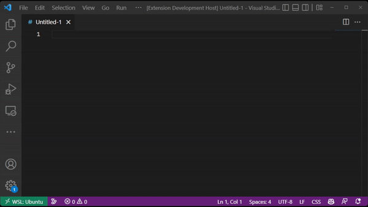

# google-font-importer README

## Features

### importFont

use the "google-font-importer.importFont" command to automatically create an import link for a font (provide the font name in an extra text field)
 

 
The extension will check if the provided font name is an available Google Font and give an error notification if it is not.
 

 

### importFontWithVariants

use the "google-font-importer.importFontWithVariants" command to automatically create an import link for a font that only includes the variants you want.

When you use the command it will first open up a text field where you can enter the font name
After you submit the input another text field will open where you can enter the font weights you want to import (separated by a comma)

 

## Release Notes

Users appreciate release notes as you update your extension.

### 1.0.0

Initial release of google-font-importer

### 1.1.0

Added feature: "google-font-importer.importFontWithVariants" - command to only import certain font weights

 
 

> everything below this is still the example stuf because I still need to write the actual readme

---

## Requirements

If you have any requirements or dependencies, add a section describing those and how to install and configure them.

## Extension Settings

Include if your extension adds any VS Code settings through the `contributes.configuration` extension point.

For example:

This extension contributes the following settings:

- `myExtension.enable`: Enable/disable this extension.
- `myExtension.thing`: Set to `blah` to do something.

## Known Issues

Calling out known issues can help limit users opening duplicate issues against your extension.

---

## Following extension guidelines

Ensure that you've read through the extensions guidelines and follow the best practices for creating your extension.

- [Extension Guidelines](https://code.visualstudio.com/api/references/extension-guidelines)

## Working with Markdown

You can author your README using Visual Studio Code. Here are some useful editor keyboard shortcuts:

- Split the editor (`Cmd+\` on macOS or `Ctrl+\` on Windows and Linux).
- Toggle preview (`Shift+Cmd+V` on macOS or `Shift+Ctrl+V` on Windows and Linux).
- Press `Ctrl+Space` (Windows, Linux, macOS) to see a list of Markdown snippets.

## For more information

- [Visual Studio Code's Markdown Support](http://code.visualstudio.com/docs/languages/markdown)
- [Markdown Syntax Reference](https://help.github.com/articles/markdown-basics/)

**Enjoy!**
